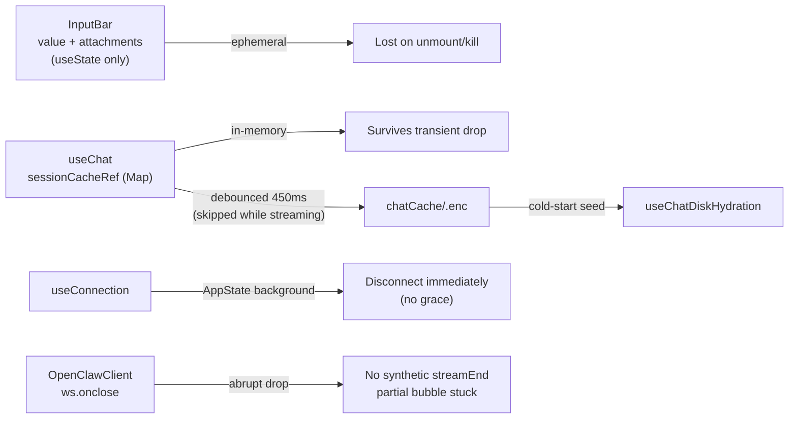

## Scope (from user's 4 points)

1. Drafts must survive signal loss, navigation, and app kill.
2. Mid-conversation messages must be visible after reconnect.
3. Partial streaming responses must never leave a "stuck" bubble; provide a retry path.
4. Short app switches must not force full handshakes.

## Defaults chosen (questions were skipped)

- **Draft scope:** per-session drafts, persisted to the encrypted disk cache alongside the message tail.
- **Interrupted UX:** "Interrupted — tap to retry" pill on the assistant bubble.

## Current-state map

## Changes

### 1. Per-session draft persistence

- Extend [src/lib/chatCache/types.ts](src/lib/chatCache/types.ts) `CachedSessionBlob` with an optional `drafts: Record<sessionKey, { text: string; attachments?: InputAttachment[]; updatedAt: number }>`.
- Bump blob `version` to `2`; update [src/lib/chatCache/validateBlob.ts](src/lib/chatCache/validateBlob.ts) to accept v1 and v2, migrating v1 -> v2 with empty drafts.
- Add a new `useDraft(sessionKey)` hook in `src/hooks/useDraft.ts`:
  - Reads the blob on mount via `readCachedSession(profileId)` and returns the draft for the current session key.
  - Exposes `setDraft({ text, attachments })` that writes back through a debounced (500 ms) call to `writeCachedSession`, **merging into the existing blob** (don't blow away messages) — so persistence piggybacks on the existing encrypted file, no second key/file.
  - Clears the draft for a session when `handleSend` succeeds.
- In [src/components/input/InputBar.tsx](src/components/input/InputBar.tsx):
  - Replace local `useState('')` and `useState<InputAttachment[]>([])` with values sourced from `useDraft(currentSessionKey)`.
  - On every keystroke / attachment change, call `setDraft(...)`; on `handleSend`, clear it.
  - Seed the TextInput with the persisted value on mount/session switch.
- Lift `currentSessionKey` into `InputBar` via a new prop from [app/index.tsx](app/index.tsx). The hook itself already exposes it.

### 2. Partial-stream graceful handling + retry

- In [src/lib/openclaw/client.ts](src/lib/openclaw/client.ts) `ws.onclose`:
  - Emit synthetic `streamEnd` for any `sessionStreams` entries with `started === true`, matching what `disconnect()` already does (client.ts:326–331). This ensures an abrupt network drop also closes out partial bubbles.
  - Emit a new `streamInterrupted` event with `{ sessionKey, lastUserMessageId }` so the UI can tag the partial assistant bubble.
- In [src/hooks/useChat.ts](src/hooks/useChat.ts):
  - Subscribe to `streamInterrupted`; in `updateSessionMessages`, set the partial assistant message's `interrupted: true` flag and capture `retryFromMessageId`.
  - Add `interrupted?: boolean` and `retryFromMessageId?: string` to [src/types/index.ts](src/types/index.ts) `ChatMessage`.
  - Expose a `retryMessage(assistantMessageId)` from `useChat` that re-sends the prior user message via `sendMessage`.
- On `chat.history` reconcile: if the server returned a full assistant turn for the same user prompt, the normal message-id merge drops the `interrupted` flag automatically (existing behavior in `onMessage`).
- In the bubble component — `src/components/chat/MessageBubble.tsx` — render an "Interrupted · Retry" pill when `message.interrupted === true`, wired to `retryMessage`.

### 3. Background-disconnect grace window

- In [src/hooks/useConnection.ts](src/hooks/useConnection.ts) AppState handler (lines 287–328):
  - On `active -> background/inactive`, **do not** immediately tear down. Instead schedule a `backgroundGraceTimerRef` for `BACKGROUND_DISCONNECT_GRACE_MS = 30_000`. Set `resumeAfterBackgroundRef.current = true`.
  - On `background/inactive -> active` within the grace window: cancel the timer, do **not** bump `connectGeneration`, keep the existing socket (it likely survived — iOS typically keeps WS alive for short backgrounds). If the socket is dead (`!client.isAlive()`), fall through to a forced reconnect.
  - If the timer fires, then run the existing disconnect-and-resume path.
- Add an `isAlive()` check surface on `OpenClawClient` (already present per client.ts:189 — just wire it).

### 4. Persist user-sent messages immediately

- In [src/hooks/useChat.ts](src/hooks/useChat.ts) `sendMessage`:
  - After appending the user message via `updateSessionMessages`, flush the disk persist timer immediately (force a write) rather than waiting for the streaming-complete path. This guarantees the user's sent text is on disk even if the app is killed mid-stream.
- Also flush on `streamInterrupted` so the partial assistant text (marked `isStreaming: false, interrupted: true`) is persisted; remove the blanket `if (isStreaming) return` skip (useChat.ts:276–278) in favor of "persist the message with `isStreaming: false` + `interrupted` flag."

### 5. Types and tests

- Update [src/types/index.ts](src/types/index.ts) ChatMessage with `interrupted?: boolean` and `retryFromMessageId?: string`.
- Add unit tests:
  - `src/lib/chatCache/validateBlob.test.ts` — v1 → v2 migration accepts missing `drafts`.
  - `src/hooks/useDraft.test.ts` — debounced write, clears on send, survives session switch.
  - `src/lib/openclaw/client.test.ts` — abrupt `ws.onclose` emits `streamInterrupted` once per active stream.

## Out of scope (deliberately)

- **Multi-session offline cache** — Option B-lite's explicit non-goal; revisit with SQLCipher per [docs/plans/option-b-encrypted-chat-cache.md](docs/plans/option-b-encrypted-chat-cache.md) §8.
- **Resuming an in-flight stream at the byte it was cut** — the gateway has no protocol for this. Retry resends the last user prompt.
- **Clipboard / keyboard grace around partial drafts.** Drafts persist on every keystroke; no clipboard fallback needed.

## Rollout order

1. Types + blob schema v2 + validator migration (no user-facing change).
2. `useDraft` hook + InputBar rewiring (immediate UX win).
3. `streamInterrupted` wiring in client + useChat + MessageBubble retry pill.
4. Immediate-flush on send; remove streaming-persist skip.
5. Background grace window.

Each step is independently shippable and reversible.
