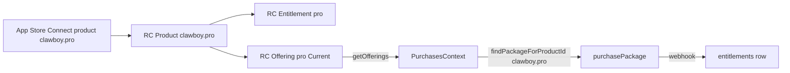

## Diagnosis

- The code expects RC **entitlement IDs** `founder` and `pro` (lowercase, singular) — see [src/lib/purchases/products.ts](src/lib/purchases/products.ts) lines 75-87 and the matching mirror in [infra/supabase/functions/purchases-webhook/index.ts](infra/supabase/functions/purchases-webhook/index.ts) lines 34-44. The DB `EntitlementTier` is also `'free' | 'pro' | 'founder'` ([src/lib/supabase/types.ts:17](src/lib/supabase/types.ts)).
- The code matches packages by **product identifier**, not offering ID: see `findPackageForProductId` in [src/contexts/PurchasesContext.tsx](src/contexts/PurchasesContext.tsx) lines 84-95 and the `priceFor` helper in [src/components/settings/SettingsEditionSection.tsx:45-55](src/components/settings/SettingsEditionSection.tsx). The required product IDs are `clawboy.founders` and `clawboy.pro` ([products.ts:20, 41](src/lib/purchases/products.ts)).
- "Purchase failed" with body **"ClawBoy Pro is not available"** is thrown at [PurchasesContext.tsx:234](src/contexts/PurchasesContext.tsx) when no offering contains a package whose `product.identifier === 'clawboy.pro'`. Most common root causes:
  1. No "Current" offering in RC, or no package at all.
  2. RC product `clawboy.pro` doesn't exist or isn't attached to an offering's package.
  3. App Store Connect product `clawboy.pro` doesn't exist / isn't "Ready to Submit" → RC can't fetch metadata → empty offerings.
  4. Invalid SDK key in `app.json` (`test_WNuRgjiqslehCeVrtBWStwPsteT` is not a valid native RC public SDK key — those are prefixed `appl_` for iOS and `goog_` for Android).

## Step 1 — RevenueCat dashboard

### 1a. Rename entitlements (case-sensitive)
- `ClawBoy Pro` → identifier `pro` (display name can stay "ClawBoy Pro")
- `Founders` → identifier `founder` (display name can stay "ClawBoy Founder's Edition")

### 1b. Create RC products (Project → Products)
- `clawboy.founders` — Apple App Store, type Non-Consumable
- `clawboy.pro` — Apple App Store, type Non-Consumable
- (Repeat for Google Play later if/when you ship Android.)

### 1c. Attach products to entitlements
- Entitlement `founder` → product `clawboy.founders`
- Entitlement `pro` → product `clawboy.pro`

### 1d. Create offerings (Project → Offerings)
- Offering identifier `founders`, one package (any identifier — e.g. the default `$rc_lifetime`) containing product `clawboy.founders`.
- Offering identifier `pro`, one package containing product `clawboy.pro`.
- **Mark one offering as "Current"** (RC requires this for `getOfferings()` to populate `current` and to show the package list). For end-to-end testing right now, mark `pro` as Current.

### 1e. Verify SDK keys
- In RC Project → Project Settings → API keys, copy the **public iOS** key (starts with `appl_`).
- The current value `"test_WNuRgjiqslehCeVrtBWStwPsteT"` in [app.json:109-110](app.json) is almost certainly not a real RC SDK key. Replace `revenueCatApiKeyIos` with the real `appl_…` value (and `revenueCatApiKeyAndroid` with `goog_…` once you set up Play).

## Step 2 — App Store Connect

- Apps → ClawBoy → Monetization → In-App Purchases → create:
  - `clawboy.founders` — Non-Consumable, $9.99 (Tier).
  - `clawboy.pro` — Non-Consumable, $19.99.
- Verify the bundle ID matches `com.anonymous.clawboy-expo` ([app.json:30](app.json)).
- Each product must reach state **"Ready to Submit"** (fill in display name, description, screenshot is required for non-consumables — a 1024×1024 placeholder is fine while testing).
- Sign the **Paid Apps Agreement** under Business → Agreements, Tax, and Banking (offerings will not load if this is missing).
- Users and Access → Sandbox Testers → add a tester (a fresh email you don't use as a real Apple ID). This is the account you'll sign into when prompted on-device.

## Step 3 — Connect RC to App Store Connect

In RC → Project Settings → Apps → your iOS app, ensure:
- Bundle ID = `com.anonymous.clawboy-expo`.
- App Store Connect API key uploaded (RC needs this to read product metadata, otherwise offerings come back without prices).
- Shared secret entered (used for receipt validation).

## Step 4 — Test on a real device

- Your `expo run:ios` build is already running in terminal 1. After updating `app.json`, restart Metro / rebuild so the new `extra.revenueCatApiKeyIos` is bundled.
- On the device: Settings → Apple Account → Media & Purchases → Sign Out (don't sign into the sandbox here; iOS prompts when you tap purchase).
- Open ClawBoy → Settings → Edition → tap "Get ClawBoy Pro". iOS will prompt to sign into the **sandbox** account.
- Use a Sandbox Tester from Step 2. Approve the purchase.
- In Metro/Xcode console, watch for `[Purchases]` debug logs (enabled in `__DEV__` at [client.ts:30-32](src/lib/purchases/client.ts)). You should see offerings populate, then a successful purchase, then a `customerInfo` update with `entitlements.active.pro`.
- Verify the UI flips to the "ClawBoy Pro — Owned" card (driven by `tier === 'pro'` in [SettingsEditionSection.tsx:240](src/components/settings/SettingsEditionSection.tsx)).

## Step 5 — Optional: webhook + Supabase sync (do after IAP works)

- Deploy `purchases-webhook` per [infra/supabase/README.md:163-179](infra/supabase/README.md).
- In RC → Project Settings → Integrations → Webhooks, set URL to your Supabase function and the Authorization header to `REVENUECAT_WEBHOOK_SECRET`.
- Because we're keeping entitlement IDs as `founder`/`pro`, the webhook ([purchases-webhook/index.ts:34-44](infra/supabase/functions/purchases-webhook/index.ts)) needs no edits.

## What does NOT need to change in code

- `src/lib/purchases/*` — already aligned.
- `PurchasesContext` — already aligned.
- `purchases-webhook` — already aligned.
- DB schema / `EntitlementTier` — already aligned.

## What might still need tweaking later (not now)

- The constants `FOUNDERS_OFFERING_ID = 'founders'` and `PRO_OFFERING_ID = 'pro'` in [products.ts:60-64](src/lib/purchases/products.ts) are currently **unused** (matching is by product ID). Either keep them for documentation or delete; not required for purchases to work.
- Once you ship Android, add a separate Google Play public key (`goog_…`) and a separate `revenueCatApiKeyAndroid` in `app.json`.