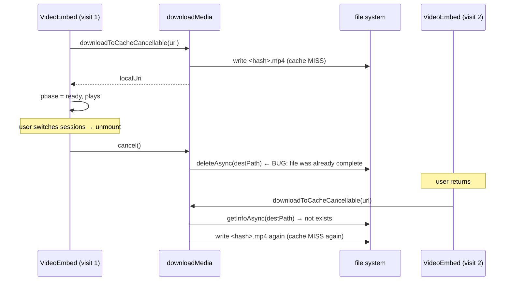

**Canonical handoff (new agents):** [docs/plans/fix-video-gateway-media-and-cache.md](../../docs/plans/fix-video-gateway-media-and-cache.md)

# Fix video playback (`byte range length mismatch -12939`) + cache controls

## Diagnosis

### Original failure (network playback, fixed by download-then-play)

iOS `AVPlayer` streams remote video with HTTP `Range:` probes. `/__openclaw__/assistant-media` returns `200` + full body instead of `206` + partial body, so AVFoundation fails with `CoreMediaErrorDomain -12939`. Images work because they do not use Range streaming the same way. The download-then-play workaround (Part A) avoids this by handing AVPlayer a `file://` URI which doesn't go through Range at all.

### New failures observed during testing of the partial implementation

The user is currently seeing two regressions after the workaround was wired in:

1. **`-12847` "unsupported media format" (with `-12864` and `-15671` follow-ups) after a 100% download.** Means the bytes saved at `<hash>.mp4` are not a parseable MP4. The gateway might be returning HTML on auth/source failures, or a codec AVPlayer doesn't support, or a truncated file. We can't tell without sniffing what's on disk.
2. **Video re-downloads on every session switch** instead of cache-hitting. Caused by `cancelFn` in [src/lib/media/downloadMedia.ts](src/lib/media/downloadMedia.ts) lines 312-319 unconditionally deleting `destPath` even when the download already completed; the cleanup in `VideoEmbed`'s `useEffect` calls `cancel()` on unmount, which nukes the just-cached file.



## Bug fixes for the partially-landed implementation (do these before continuing)

### B1. `cancelFn` must not delete a completed file ([src/lib/media/downloadMedia.ts](src/lib/media/downloadMedia.ts))

Add a `let completed = false;` flag inside `doDownload`. Set `completed = true` at the same point we `addManifestEntry` (i.e. after we've returned a successful, non-cancelled result). Update the cancel implementation:

```ts
cancelFn = async () => {
  if (completed) return;          // <-- new
  try { await dl.pauseAsync(); } catch {}
  await FileSystem.deleteAsync(destPath, { idempotent: true }).catch(() => {});
};
```

Also remove the `cancelFn` entry from `cancelRegistry` once `completed` (and once errored) so `cancelAllDownloads()` cannot retroactively delete cached files. The registry should only ever contain in-progress downloads.

### B2. Validate the saved bytes before declaring success ([src/lib/media/downloadMedia.ts](src/lib/media/downloadMedia.ts))

After `dl.downloadAsync()` returns 2xx, before resolving the promise, read the first 12 bytes of `destPath`:

```ts
const head = await FileSystem.readAsStringAsync(destPath, {
  encoding: FileSystem.EncodingType.Base64,
  position: 0,
  length: 12,
});
const bytes = base64ToBytes(head);  // existing helper or inline atob
```

Apply the following checks:

- If the response `Content-Type` was `text/html` *or* the bytes start with `<` (`0x3C`) and look like `<!DOCTYPE`/`<html`/`<HTML`: delete the file, throw a typed error `MediaSavedFileError('html')`.
- If the file size is 0: delete, throw `MediaSavedFileError('other')`.
- For `.mp4` extensions: if bytes 4–7 are not the ASCII string `ftyp`, log a `__DEV__` warning but still surrender to AVPlayer (the file may be a valid container we don't recognize).

`VideoEmbed`'s catch branch already runs `diagnoseMediaFailure` — instead, when we get a `MediaSavedFileError`, propagate its `reason` directly to `setVideoState({ phase: 'error', reason })` so the user sees an accurate `MediaFallbackCard` subtitle without a second network request.

### B3. Dev-only debug log

When `__DEV__`, after the bytes validation passes, log:

```
[downloadMedia] cached <hash>.<ext> size=<bytes> head=<12-byte hex>
```

No URL, no token. This lets us verify on-device whether the gateway is delivering a real MP4 (`66 74 79 70` at offset 4) or a HTML page (`3C 21 44 4F 43 54 59 50 45` for `<!DOCTYPE`) without instrumenting every visit.

## Part A — Client (this repo)

### A1. `downloadMedia.ts`

- `downloadToCacheCancellable(url, token, opts)` returning `{ promise, cancel }`; keep `downloadToCache` as thin wrapper.
- Opts: `onProgress`, `profileId` (hash input `${profileId}\u0000${url}`), `ephemeral?: boolean` (dest under `clawboy-media/ephemeral/` vs hashed persistent path).
- In-flight `Map<destPath, Promise<DownloadResult>>` for dedup.
- HEAD pre-flight: reject if `Content-Length` present and `> 256 * 1024 * 1024`.
- **LRU total budget (1 GB):** After a successful write, sum sizes of files under `clawboy-media/` (persistent subtree only, exclude `ephemeral/` from the budget so ephemeral files are governed by unmount-only cleanup). Persist a small `manifest.json` next to the cache dir `{ entries: [{ path, size, lastAccessMs }] }` updated on write and on cache hit (`touchCacheEntry`), or scan `readDirectoryAsync` + `getInfoAsync` per file if manifest is too brittle — prefer manifest for O(1) total. Delete oldest by `lastAccessMs` until total under cap.
- `clearMediaCache()`: delete entire `clawboy-media/` tree including `ephemeral/` and reset manifest.

### A2. `useMediaCacheReplay` + AsyncStorage

- Key: `clawboy-media-cache-replay`, JSON boolean, **default `true`** (first install: replay + LRU behavior).
- When **`false`**: `VideoEmbed` passes `ephemeral: true` to download; on unmount (and on URL change) delete that file and call `cancel()` on download. No LRU entry for ephemeral files (or exclude from manifest).

### A3. `VideoEmbed.tsx`

- State machine: loading (progress) / ready (`file://`) / error (`MediaFailureCard` + `diagnoseMediaFailure`).
- Wire `useMediaCacheReplay`, `useConnection` (disconnect cancel), `useAuthedMedia` + active profile id from `useServerConfig` (or connection context if profile id is already there — use whatever is stable for `profileId` in hash).
- Remove `127.0.0.1:7890` debug ingest in `getExpoVideo`.

### A4. Cache lifecycle

- `clearMediaCache` on active profile change and on logout/disconnect (not only `removeProfile`).
- Global registry of active `cancel()` handles; clear on disconnect.

### A5. Settings UI ([src/components/settings/SettingsMetaPanels.tsx](src/components/settings/SettingsMetaPanels.tsx))

- New **Media** block (or rows inside **General**):  
  - **Switch:** "Cache videos for replay" — subtitle explaining lower disk footprint / no replay cache when off.  
  - **Button / destructive row:** "Clear downloaded media" — `await clearMediaCache()`, then `Alert.alert` success (no byte counts required in v1; optional `getMediaCacheUsageBytes()` if cheap).
- Read/write pref via the same hook or local state + `AsyncStorage` on toggle.

### A6. Security (unchanged intent)

- Token only in `Authorization` header over HTTPS; hashed filenames; `setExcludedFromBackupsAsync`; profile-scoped keys; clear on switch/logout; 256 MB/file + 1 GB total; ephemeral path when user opts out of replay.

### A7. Tests + manual QA

- Unit tests for download helper (progress, dedup, profile isolation, HEAD reject, LRU eviction ordering).
- Snapshots: `VideoEmbed` loading/error.
- Manual: Discord video; toggle off = re-download each open; Settings clear; synthetic fill past 1 GB evicts oldest persistent entries.

## Part B — Gateway (doc only)

Create [docs/plans/gateway-range-support.md](docs/plans/gateway-range-support.md): `handleControlUiAssistantMediaRequest` must honor `Range`, respond `206`, set `Content-Range`, `Accept-Ranges: bytes`, `416` on bad range; `curl --range 0-99` smoke test.

## Dependency note

`VideoEmbed` needs `profileId` for namespaced cache: use `activeProfile?.id` from [src/hooks/useServerConfig.tsx](src/hooks/useServerConfig.tsx) (same id passed to `deleteCachedSession(id)`). Fall back to `'_'` when null (disconnected / no profile).
