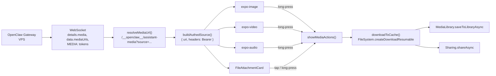

# Display/download OpenClaw server-hosted files

## What's broken today (baseline)

- Wrong endpoint: `parseMediaTokens` / `classifyMediaUrls` in [src/lib/openclaw/utils.ts](src/lib/openclaw/utils.ts) construct `${host}/media/<path>`. The real gateway route is `GET /__openclaw__/assistant-media?source=<path>` (see `handleControlUiAssistantMediaRequest` in `openclaw/openclaw` `src/gateway/control-ui.ts`).
- No auth: `<Image source={{uri}}>` and `useAudioPlayer(url)` hit the gateway with no `Authorization` header. Modern gateways return 401.
- Videos are captured but never rendered (`MediaEmbed` props only cover `images` + `audioUrl`).
- Documents are pushed into `images[]` in [src/lib/openclaw/client.ts](src/lib/openclaw/client.ts) lines ~994 and ~1292 — PDFs render as broken image thumbnails.
- No save/share UX: `expo-sharing`, `expo-media-library`, `expo-video` are not installed.

## Design

### 1. Endpoint + auth contract (one helper, one place)

New module [src/lib/media/gatewayMedia.ts](src/lib/media/gatewayMedia.ts) with:

- `resolveMediaUrl(raw, gatewayUrl): { url, isLocalSource }` — canonical URL builder:
  - `file://` or absolute POSIX paths (`/...`, `~/...`) → `${httpHost}/__openclaw__/assistant-media?source=${encodeURIComponent(path)}`
  - `data:` URIs and `https?://` URLs → returned as-is
  - Rejects `javascript:`, `blob:`, unknown schemes (defense-in-depth per `.cursorrules` rule 3).
- `buildAuthedSource(url, token): { uri, headers }` — returns `{ uri, headers: { Authorization: 'Bearer <token>' } }` for use with `expo-image`, `expo-audio`, `expo-video`, and `FileSystem.downloadAsync`.
- `buildAuthedSourceNoHeaders(url, token)` — tokenized-query fallback (`?token=<token>`) for the rare consumer that can't accept headers; **only used when a caller opts in**, never by default. Token is never logged.

Token source: active connection's token, resolved via a new `useAuthedMedia()` hook that reads from `useConnection()` (the `credentialsRef.current.token` path already exists in [src/hooks/useConnection.ts](src/hooks/useConnection.ts)). On logout/profile-switch the hook emits a new token so cached consumers get fresh sources. Tokens live only in memory inside the hook — nothing new is persisted.

Rewrite the URL builders in [src/lib/openclaw/utils.ts](src/lib/openclaw/utils.ts):

```ts
// parseMediaTokens + classifyMediaUrls — replace the "${baseUrl}/media/..." branch:
const resolved = resolveMediaUrl(mediaPath, gatewayUrl)
if (!resolved) continue
url = resolved.url
```

Existing callers in [src/lib/openclaw/client.ts](src/lib/openclaw/client.ts) (lines ~962, ~1233, ~1252) and [src/lib/openclaw/chat.ts](src/lib/openclaw/chat.ts) (line ~214) continue to work unchanged.

### 2. Separate documents from images

Extend the message shape so non-displayable files aren't forced into `images[]`:

- [src/types/index.ts](src/types/index.ts): add `files?: Array<{ url: string; name: string; mimeType?: string; sizeBytes?: number }>` to `OpenClawMessage`, propagate in `openClawMessageToChat`.
- [src/types/chat-ui.ts](src/types/chat-ui.ts): add the same `files?: ...` to `ChatUiMessage` alongside the existing `fileAttachments` (keep `fileAttachments` for optimistic user-sent pills).
- [src/lib/openclaw/client.ts](src/lib/openclaw/client.ts): at lines ~994 and ~1292, route `m.type === 'document'` into `files[]` instead of `images[]`.

### 3. New renderers

- `VideoEmbed` (new file [src/components/chat/VideoEmbed.tsx](src/components/chat/VideoEmbed.tsx)) — uses `useVideoPlayer(buildAuthedSource(url, token))` + `<VideoView>` from `expo-video`. Tap-to-fullscreen.
- `FileAttachmentCard` (new file [src/components/chat/FileAttachmentCard.tsx](src/components/chat/FileAttachmentCard.tsx)) — icon-by-extension, filename, optional size, tap triggers download-then-share (flow 5), long-press shows action sheet.
- [src/components/chat/MediaEmbed.tsx](src/components/chat/MediaEmbed.tsx):
  - Accept `videoUrl?: string` and `files?` props.
  - Swap the raw `<Image source={{ uri: src }}>` for `<Image source={buildAuthedSource(src, token)}>`.
  - Same for `AudioEmbed` — pass the authed source to `useAudioPlayer`.
  - Add long-press on image thumbs → open the media action sheet (flow 5).

### 4. Authenticated download + on-device cache

New module [src/lib/media/downloadMedia.ts](src/lib/media/downloadMedia.ts):

- `downloadToCache(url, token, { fileName, mimeType }) → Promise<{ localUri; mimeType }>`:
  - Cache path: `FileSystem.cacheDirectory + 'media/' + sha1(url) + ext`.
  - Uses `FileSystem.createDownloadResumable(url, dest, { headers: { Authorization: 'Bearer <token>' }})` — reuses existing cached file if present.
  - Marks `FileSystem.setExcludedFromBackupAsync` on the media cache dir to match the chat-cache convention already used in [src/lib/chatCache/store.ts](src/lib/chatCache/store.ts).
- `clearMediaCache()` — called from profile-switch / logout in `useServerConfig`.

### 5. Save / Share UX (full scope per user decision)

New module [src/lib/media/mediaActions.ts](src/lib/media/mediaActions.ts) exposing `showMediaActions({ url, kind, fileName, mimeType })`:

```
kind = 'image' | 'video' | 'audio' | 'file'
```

Action sheet (iOS `ActionSheetIOS`, Android `Alert`) options:
- `image` / `video` → { "Save to Photos", "Share…", "Copy link" }
- `audio` / `file` → { "Save to Files", "Share…", "Copy link" }

Implementations:
- **Save to Photos** → `MediaLibrary.requestPermissionsAsync()` → `downloadToCache(...)` → `MediaLibrary.saveToLibraryAsync(localUri)`. Requires `expo-media-library`.
- **Share / Save to Files** → `Sharing.shareAsync(localUri, { mimeType, UTI })`. Requires `expo-sharing`.
- **Copy link** → `Clipboard.setStringAsync(publicUrl)` — strips `?token=` if present, warns/clears after 60s per `.cursorrules` rule 9.

Wired into:
- Long-press on any image thumb and the expanded modal in `MediaEmbed`.
- Long-press on audio waveform and video poster.
- Tap on `FileAttachmentCard` (primary = Share; long-press = full menu).

### 6. Dependencies + config

- `package.json`: add `expo-video`, `expo-sharing`, `expo-media-library` (install via `npx expo install …` to pick SDK 55 compatible versions).
- [app.json](app.json): add iOS Info.plist entries:
  - `NSPhotoLibraryAddUsageDescription` — "Save media you receive from your agents to your photo library."
  - `NSPhotoLibraryUsageDescription` — optional, only if we later add a picker; skip now.

### 7. Security guardrails (per `.cursorrules`)

- Rule 3 (sanitize rendered content): whitelist `data:image/*`, `data:audio/*`, `https://`, and gateway-resolved URLs. Reject anything else before it reaches a renderer.
- Rule 9 (secure clipboard): `mediaActions.copyLink` schedules a clipboard clear after 60s.
- Rule 10 (memory safety): the authed-media hook clears its in-memory token ref on `useConnection` disconnect; cache dir is purged on profile switch.
- Tokens never travel via query string by default — only `Authorization` header. The query-string fallback stays available for debugging but isn't wired into any component.
- Log format: `downloadMedia` logs only the path hash, never the URL or token.

### 8. Tests

- [src/lib/media/__tests__/gatewayMedia.test.ts](src/lib/media/__tests__/gatewayMedia.test.ts) — URL resolution: absolute paths, `file://`, `~`, unsafe schemes, pre-existing `https://`, URL-encoding of spaces / unicode, correct host derivation from `wss://` / `ws://`.
- Add cases to [src/lib/__tests__/openclaw-client.test.ts](src/lib/__tests__/openclaw-client.test.ts) for `details.media` with `type:'document'` routing into `files[]` (not `images[]`).
- Snapshot test for `FileAttachmentCard` mirroring the existing `src/components/chat/__tests__/ToolCallCard.test.tsx` pattern.

## Data flow diagram



## Out of scope for this plan

- Certificate pinning (Phase 2 per `.cursorrules`; the design doesn't preclude it — we go through standard RN networking).
- Large-file progress UI beyond a simple spinner.
- Resumable downloads surviving app suspend.
- Range requests for video scrubbing (relies on gateway Range-header support; no change needed client-side if it's there).
