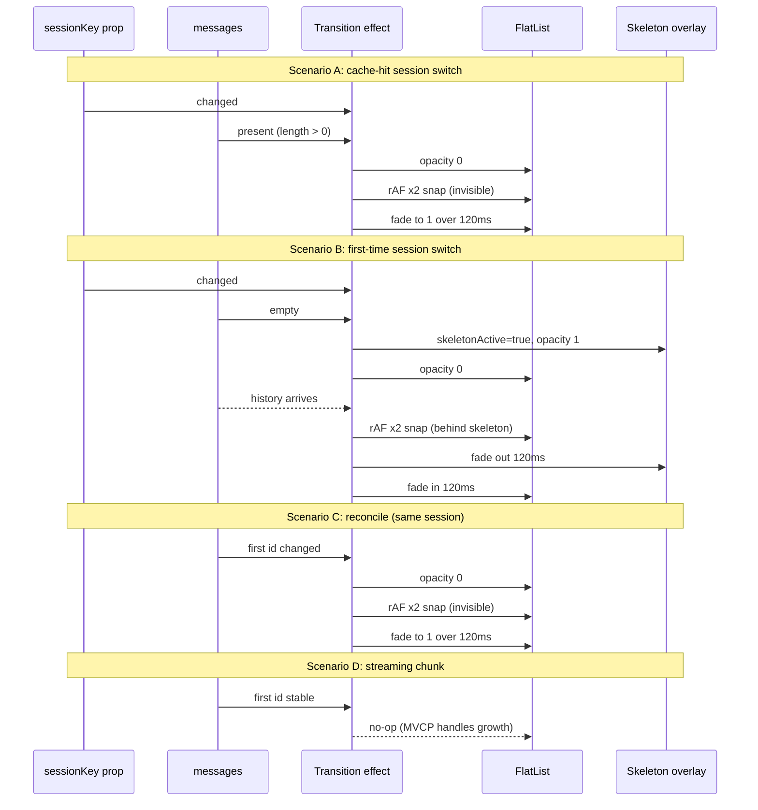

## Why the flashes still happen

The remaining flicker is caused by the snap correction itself, not by missing snaps:

- On FlatList mount (or when data arrives into a freshly mounted FlatList), MVCP plus batched cell measurement land the content at a slightly non-zero offset for 1-2 frames.
- Our `useEffect([messages])` rAF x2 snap then forces it to offset 0.
- The transition from "off" to "0" is **the** flash — it's our correction, made visible because the FlatList is fully opaque the whole time.

The fix is to perform that correction while the list is invisible, then fade it in.

## Behavior matrix

- **Session switch, no cache** -> messages.length === 0 at switch -> show `MessageListSkeleton` until messages arrive, then cross-fade into the FlatList (skeleton fades out, list fades in over 120ms).
- **Session switch, cache hit** -> messages.length > 0 immediately -> opacity fade only: list at opacity 0 during the snap, fade to 1 over 120ms. No skeleton.
- **Same-session bulk swap (reconcile after connect)** -> first message id changed -> opacity fade only.
- **Streaming chunk / new user msg / new assistant placeholder** -> first message id stable -> no transition. Normal render.

The "first message id" check is the key heuristic: it cleanly separates bulk swaps (history load, session switch, reconcile) from incremental updates (streaming, sending), without coupling MessageList to any internal useChat state.

## Concrete changes (single file)

All changes in [`src/components/chat/MessageList.tsx`](src/components/chat/MessageList.tsx).

### 1. New shared values + transition state

```tsx
const listOpacity = useSharedValue(1);
const skeletonOpacity = useSharedValue(0);
const [skeletonActive, setSkeletonActive] = useState(false);

const prevSessionKeyRef = useRef(sessionKey);
const prevFirstIdRef = useRef<string | null>(messages[0]?.id ?? null);
const transitionTimerRef = useRef<ReturnType<typeof setTimeout> | null>(null);
```

### 2. Single transition driver effect

```tsx
useEffect(() => {
  const sessionChanged = prevSessionKeyRef.current !== sessionKey;
  const firstId = messages[0]?.id ?? null;
  const firstIdChanged = firstId !== prevFirstIdRef.current;
  prevSessionKeyRef.current = sessionKey;
  prevFirstIdRef.current = firstId;

  // Streaming / send / no-op cases: do nothing.
  if (!sessionChanged && !firstIdChanged) return;
  if (!sessionChanged && messages.length === 0) return;

  // Session switch with no cached messages: skeleton bridge.
  if (sessionChanged && messages.length === 0) {
    setSkeletonActive(true);
    skeletonOpacity.value = 1;
    listOpacity.value = 0;
    return;
  }

  // We have content to show. Snap invisibly, then fade in.
  // If the skeleton was up, cross-fade; otherwise just fade the list.
  listOpacity.value = 0;
  if (skeletonActive) {
    skeletonOpacity.value = 1; // guarantee covered through the snap
  }

  // Two rAFs of snap so cell-measurement settle is invisible.
  const r1 = requestAnimationFrame(() => {
    snapIfPinned();
    requestAnimationFrame(() => {
      snapIfPinned();
      listOpacity.value = withTiming(1, { duration: 120 });
      if (skeletonActive) {
        skeletonOpacity.value = withTiming(0, { duration: 120 });
      }
    });
  });

  // Unmount the skeleton after its fade completes.
  if (skeletonActive) {
    if (transitionTimerRef.current) clearTimeout(transitionTimerRef.current);
    transitionTimerRef.current = setTimeout(() => {
      setSkeletonActive(false);
      transitionTimerRef.current = null;
    }, 150);
  }

  return () => cancelAnimationFrame(r1);
}, [sessionKey, messages, snapIfPinned, skeletonActive, listOpacity, skeletonOpacity]);
```

### 3. Replace the existing rAF snap effect

Remove the standalone `useEffect([messages, snapIfPinned])` that does rAF x2 snap. The new transition driver above subsumes it (same rAF logic, but only inside transitions where snapping is actually needed). Streaming chunks no longer trigger any snap, which is correct — MVCP handles in-place growth.

Keep `onContentSizeChange={snapIfPinned}` and `onLayout={snapIfPinned}` as safety nets for edge cases (banner animating, keyboard show/hide).

### 4. Render: stack skeleton over FlatList during transitions

Wrap the FlatList in an Animated.View bound to `listOpacity`. When `skeletonActive`, render the skeleton in an absolutely-positioned Animated.View above it (so the snap correction happens behind it).

```tsx
{isLoading && messages.length === 0 ? (
  <MessageListSkeleton />
) : !isLoading && messages.length === 0 && !skeletonActive && emptyStateSlot ? (
  emptyStateSlot
) : (
  <View style={styles.stack}>
    <Animated.View style={[styles.flex, listAnimatedStyle]}>
      <FlatList ... />
    </Animated.View>
    {skeletonActive ? (
      <Animated.View style={[StyleSheet.absoluteFill, skeletonAnimatedStyle]} pointerEvents="none">
        <MessageListSkeleton />
      </Animated.View>
    ) : null}
  </View>
)}
```

`listAnimatedStyle` and `skeletonAnimatedStyle` use `useAnimatedStyle` to read the shared values. Add `stack: { flex: 1, position: 'relative' }` and `flex: { flex: 1 }` to the StyleSheet.

### 5. Cleanup

Clear `transitionTimerRef` on unmount (existing pattern with the rAF ref already does this).

## Animation flow (the four scenarios)



## Files changed

- [`src/components/chat/MessageList.tsx`](src/components/chat/MessageList.tsx): all of the above.

No changes elsewhere.

## Validation

1. Reload on main -> no gap, no scroll-up-and-back flash. Brief opacity fade on cold start; reconcile after connect cross-fades smoothly.
2. First switch to memory-distill -> skeleton holds while history loads, then cross-fades to content already at the bottom. No "starts above bottom".
3. Cycle main -> discord -> memory-distill -> cache hit shows quick fade-in, no flash.
4. Repeat case 4 from the original list -> stays glued to bottom (already fixed).
5. Streaming a long response -> bubbles render and grow without any fade (regression check).
6. While scrolled up mid-history, new assistant message shows the "New messages" pill (regression check).
