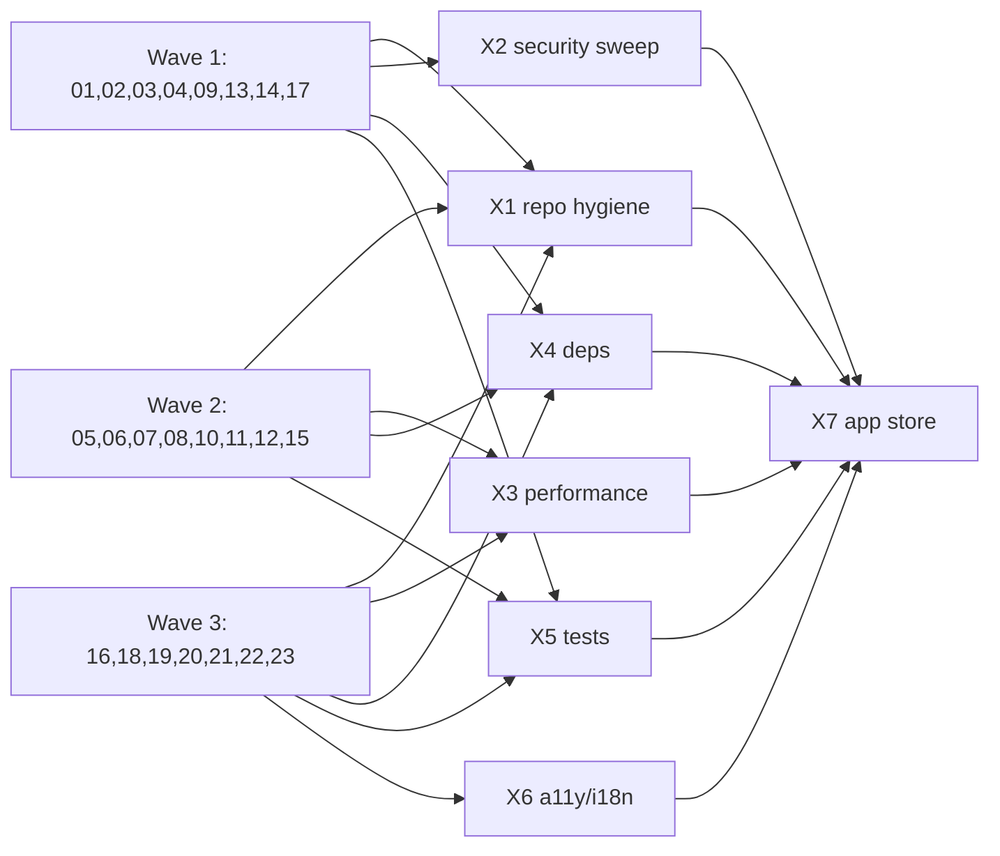

# ClawBoy Pre-Release Audit

Comprehensive feature-by-feature code review before App Store submission and open-source release. Each plan runs in a **fresh, isolated agent** so context windows stay clean.

---

## How to Run

1. Open a plan file (e.g. `docs/audits/01-gateway-protocol.md`).
2. Click **Run plan in new agent** (or start a fresh Cursor chat and attach the plan file).
3. The agent reads the plan, runs the checklist, writes `docs/audits/findings/<area>-findings.md`, applies allowed auto-fixes, updates its row below to `done`.
4. Per-area plans (`01`–`23`) are **independent** — fan out in parallel across multiple agents.
5. Cross-cutting plans (`X1`–`X7`) run **after** all per-area plans they depend on show `done`.
6. Final step: `X7-app-store-readiness.md` produces the release go/no-go doc.

### Agent instructions (paste at top of every new chat)

> You are running the audit plan at `docs/audits/<filename>.md`. Read that file in full before touching anything. Your allowed actions and forbidden actions are defined in `docs/audits/_RULES.md`. Write your findings to `docs/audits/findings/<area>-findings.md`. Update your status row in `docs/audits/README.md` to `done` when finished.

---

## Status Table

Update your row when you begin (`in_progress`) and when you finish (`done`). Do not modify other rows.

### Per-Area Plans

| ID | Plan File | Scope (summary) | Status | Findings | Sev: C/H/M/L/N | Updated |
|----|-----------|-----------------|--------|----------|-----------------|---------|
| 01 | [01-gateway-protocol.md](01-gateway-protocol.md) | `src/lib/openclaw/` + pinned-ws module | done | [01-gateway-protocol-findings.md](findings/01-gateway-protocol-findings.md) | 0/1/4/8/4 | 2026-05-09 |
| 02 | [02-auth-pairing.md](02-auth-pairing.md) | device-identity, ConnectionContext, useConnection, auth-callback | done | [02-auth-pairing-findings.md](findings/02-auth-pairing-findings.md) | 0/1/3/6/2 | 2026-05-09 |
| 03 | [03-server-profiles.md](03-server-profiles.md) | useServerConfig, ServerProfileSync, AddServerSheet, pinning UI | done | [03-server-profiles-findings.md](findings/03-server-profiles-findings.md) | 0/1/2/4/3 | 2026-05-09 |
| 04 | [04-chat-streaming.md](04-chat-streaming.md) | chat components, useChat, chatCache, messageBlocks, streamReveal | done | [04-chat-streaming-findings.md](findings/04-chat-streaming-findings.md) | 0/0/3/3/2 | 2026-05-09 |
| 05 | [05-input-slash-commands.md](05-input-slash-commands.md) | InputBar, SlashCommandPalette, useCommands, useDraft | done | [05-input-slash-commands-findings.md](findings/05-input-slash-commands-findings.md) | 0/0/0/5/5 | 2026-05-11 |
| 06 | [06-sessions-sidebar.md](06-sessions-sidebar.md) | SessionSidebar, useSessions, gesture drawer | done | [06-sessions-sidebar-findings.md](findings/06-sessions-sidebar-findings.md) | 0/0/2/5/3 | 2026-05-11 |
| 07 | [07-agents-models-skills.md](07-agents-models-skills.md) | useAgents, useModels, useAgentFiles, modelProvider | done | [07-agents-models-skills-findings.md](findings/07-agents-models-skills-findings.md) | 0/1/2/3/4 | 2026-05-11 |
| 08 | [08-onboarding.md](08-onboarding.md) | OnboardingScreen (1101 lines — split candidate), app/onboarding | done | [08-onboarding-findings.md](findings/08-onboarding-findings.md) | 0/1/2/2/2 | 2026-05-11 |
| 09 | [09-settings.md](09-settings.md) | settings components + app/settings/ screens | done | [09-settings-findings.md](findings/09-settings-findings.md) | 0/0/3/6/6 | 2026-05-09 |
| 10 | [10-voice-tts.md](10-voice-tts.md) | src/lib/voice/, TTS hooks, voice settings | done | [10-voice-tts-findings.md](findings/10-voice-tts-findings.md) | 0/1/2/3/1 | 2026-05-11 |
| 11 | [11-media-attachments.md](11-media-attachments.md) | src/lib/media/, attachments, MediaEmbed, VideoEmbed | done | [11-media-attachments-findings.md](findings/11-media-attachments-findings.md) | 0/0/3/6/4 | 2026-05-11 |
| 12 | [12-annotations.md](12-annotations.md) | annotations.ts, AnnotationContext, annotation components | done | [12-annotations-findings.md](findings/12-annotations-findings.md) | 0/0/2/3/2 | 2026-05-11 |
| 13 | [13-purchases-iap.md](13-purchases-iap.md) | src/lib/purchases/, PurchasesContext | done | [13-purchases-iap-findings.md](findings/13-purchases-iap-findings.md) | 0/2/5/4/2 | 2026-05-09 |
| 14 | [14-account-supabase.md](14-account-supabase.md) | src/lib/supabase/, AccountContext, account UI | done | [14-account-supabase-findings.md](findings/14-account-supabase-findings.md) | 0/1/2/4/2 | 2026-05-09 |
| 15 | [15-achievements-badges.md](15-achievements-badges.md) | badges components, achievements screen | done | [15-achievements-badges-findings.md](findings/15-achievements-badges-findings.md) | 0/0/2/5/4 | 2026-05-11 |
| 16 | [16-demo-mode.md](16-demo-mode.md) | src/lib/demo/, DemoModeBanner, useChat demo branch | done | [16-demo-mode-findings.md](findings/16-demo-mode-findings.md) | 0/1/2/5/2 | 2026-05-11 |
| 17 | [17-ota-updates.md](17-ota-updates.md) | useOTAUpdate, UpdateNudgeBanner, certs/, app.json updates | done | [17-ota-updates-findings.md](findings/17-ota-updates-findings.md) | 0/0/2/2/3 | 2026-05-09 |
| 18 | [18-feedback-worker.md](18-feedback-worker.md) | infra/feedback-worker/, src/lib/feedback/, FeedbackSheet | done | [18-feedback-worker-findings.md](findings/18-feedback-worker-findings.md) | 0/0/4/4/2 | 2026-05-11 |
| 19 | [19-conventions.md](19-conventions.md) | ConventionInstallContext, installConventions, conventions UI | done | [19-conventions-findings.md](findings/19-conventions-findings.md) | 0/0/1/5/2 | 2026-05-11 |
| 20 | [20-theme-i18n-appearance.md](20-theme-i18n-appearance.md) | ThemeContext, LanguageContext, i18n/, appearance settings | done | [20-theme-i18n-appearance-findings.md](findings/20-theme-i18n-appearance-findings.md) | 1/1/2/4/4 | 2026-05-11 |
| 21 | [21-native-module-pinned-ws.md](21-native-module-pinned-ws.md) | modules/expo-pinned-websocket/ (native Swift/ObjC + JS) | done | [21-native-module-pinned-ws-findings.md](findings/21-native-module-pinned-ws-findings.md) | 0/0/2/3/4 | 2026-05-11 |
| 22 | [22-ios-native-config.md](22-ios-native-config.md) | ios/ClawBoy/, app.json, eas.json, permissions, privacy manifest | done | [22-ios-native-config-findings.md](findings/22-ios-native-config-findings.md) | 0/3/5/4/3 | 2026-05-11 |
| 23 | [23-supabase-migrations.md](23-supabase-migrations.md) | supabase/migrations/, RLS policies | done | [23-supabase-migrations-findings.md](findings/23-supabase-migrations-findings.md) | 0/2/3/4/2 | 2026-05-11 |

### Cross-Cutting Plans (run after per-area)

| ID | Plan File | Depends On | Status | Findings | Sev: C/H/M/L/N | Updated |
|----|-----------|------------|--------|----------|-----------------|---------|
| X1 | [X1-repo-hygiene-oss.md](X1-repo-hygiene-oss.md) | all 01–23 | done | [X1-repo-hygiene-oss-findings.md](findings/X1-repo-hygiene-oss-findings.md) | 0/1/1/5/0 | 2026-05-11 |
| X2 | [X2-security-sweep.md](X2-security-sweep.md) | 01, 02, 03, 13, 14, 17 | done | [X2-security-sweep-findings.md](findings/X2-security-sweep-findings.md) | 0/0/0/0/0 | 2026-05-12 |
| X3 | [X3-performance-sweep.md](X3-performance-sweep.md) | 04, 05, 06, 11 | todo | — | — | — |
| X4 | [X4-deps-and-licenses.md](X4-deps-and-licenses.md) | all 01–23 | todo | — | — | — |
| X5 | [X5-test-coverage.md](X5-test-coverage.md) | all 01–23 | todo | — | — | — |
| X6 | [X6-a11y-i18n.md](X6-a11y-i18n.md) | 20 | todo | — | — | — |
| X7 | [X7-app-store-readiness.md](X7-app-store-readiness.md) | X1, X2, X3, X4 | todo | — | — | — |

---

## Wave Strategy

Run plans in four waves. Waves 1–3 are fully parallel (each plan is independent). Wave 4 is sequential because each cross-cutting plan reads prior findings. See `docs/audits/_KICKOFF.md` for kickoff prompt and Background Agent steps.

### Wave 1 — parallel, 8 agents (start here)

Security-critical and high-value plans that unlock the most cross-cutting analysis. Safe to run in parallel — no plan in this wave depends on another.

| Plan | Scope summary | Model |
|------|---------------|-------|
| [01-gateway-protocol.md](01-gateway-protocol.md) | openclaw/ protocol layer + pinned-ws | Opus |
| [02-auth-pairing.md](02-auth-pairing.md) | device-identity, auth flow, challenge-response | Opus |
| [03-server-profiles.md](03-server-profiles.md) | server profiles, pinning UI, connection test | Sonnet |
| [04-chat-streaming.md](04-chat-streaming.md) | chat UI, useChat, chatCache, stream isolation | Sonnet |
| [09-settings.md](09-settings.md) | settings components + app/settings/ | Sonnet |
| [13-purchases-iap.md](13-purchases-iap.md) | purchases, IAP, restore path | Opus |
| [14-account-supabase.md](14-account-supabase.md) | supabase auth, AccountContext, secure storage | Sonnet |
| [17-ota-updates.md](17-ota-updates.md) | OTA updates, cert key audit | Sonnet |

### Wave 2 — parallel, 8 agents

Feature-area UI and logic plans. No cross-wave dependencies within this group.

| Plan | Scope summary | Model |
|------|---------------|-------|
| [05-input-slash-commands.md](05-input-slash-commands.md) | InputBar, slash commands, draft | Sonnet |
| [06-sessions-sidebar.md](06-sessions-sidebar.md) | SessionSidebar, useSessions, gesture drawer | Sonnet |
| [07-agents-models-skills.md](07-agents-models-skills.md) | useAgents, useModels, modelProvider | Sonnet |
| [08-onboarding.md](08-onboarding.md) | OnboardingScreen (split candidate), onboarding flow | Sonnet |
| [10-voice-tts.md](10-voice-tts.md) | voice/, TTS hooks, audio policy | Sonnet |
| [11-media-attachments.md](11-media-attachments.md) | media/, attachments, MediaEmbed | Sonnet |
| [12-annotations.md](12-annotations.md) | annotations.ts, AnnotationContext, annotation components | Sonnet |
| [15-achievements-badges.md](15-achievements-badges.md) | badges, achievements screen | Sonnet |

### Wave 3 — parallel, 7 agents

Remaining feature plans. All independent.

| Plan | Scope summary | Model |
|------|---------------|-------|
| [16-demo-mode.md](16-demo-mode.md) | demo/, DemoModeBanner, demo branch | Sonnet |
| [18-feedback-worker.md](18-feedback-worker.md) | feedback-worker, FeedbackSheet, dev bypass | Sonnet |
| [19-conventions.md](19-conventions.md) | ConventionInstallContext, installConventions | Sonnet |
| [20-theme-i18n-appearance.md](20-theme-i18n-appearance.md) | ThemeContext, LanguageContext, i18n/ | Sonnet |
| [21-native-module-pinned-ws.md](21-native-module-pinned-ws.md) | modules/expo-pinned-websocket/ (native + JS) | Sonnet |
| [22-ios-native-config.md](22-ios-native-config.md) | ios/ClawBoy/, app.json, privacy manifest | Opus |
| [23-supabase-migrations.md](23-supabase-migrations.md) | supabase/migrations/, RLS policies | Opus |

### Wave 4 — sequential, 7 agents (one at a time)

Cross-cutting plans. Each reads prior findings, so they must run in order. Start X1 only after all Waves 1–3 are `done`.

| Plan | Depends on | Model |
|------|-----------|-------|
| [X1-repo-hygiene-oss.md](X1-repo-hygiene-oss.md) | all 01–23 done | Sonnet |
| [X2-security-sweep.md](X2-security-sweep.md) | 01, 02, 03, 13, 14, 17 done | Opus |
| [X3-performance-sweep.md](X3-performance-sweep.md) | 04, 05, 06, 11 done | Sonnet |
| [X4-deps-and-licenses.md](X4-deps-and-licenses.md) | all 01–23 done | Sonnet |
| [X5-test-coverage.md](X5-test-coverage.md) | all 01–23 done | Sonnet |
| [X6-a11y-i18n.md](X6-a11y-i18n.md) | 20 done | Sonnet |
| [X7-app-store-readiness.md](X7-app-store-readiness.md) | X1, X2, X3, X4, X5, X6 done | Opus |

---

## Model Recommendations

| Plan | Model | Rationale |
|------|-------|-----------|
| 01-gateway-protocol | **Opus** | Concurrency subtleties: `_connectGeneration` guard, stream isolation, response watchdog — easy to miss without careful reasoning |
| 02-auth-pairing | **Opus** | Security root of trust; Ed25519 signing, deeplink validation, auth state machine — must not miss a flaw |
| 03-server-profiles | Sonnet | Pattern audit: token storage, URL normalization, UI correctness |
| 04-chat-streaming | Sonnet | Pattern audit: memo, FlashList config, stream isolation already defined in plan 01 |
| 05-input-slash-commands | Sonnet | UI pattern audit, mostly mechanical |
| 06-sessions-sidebar | Sonnet | UI pattern audit |
| 07-agents-models-skills | Sonnet | Straightforward data-fetching + picker UI |
| 08-onboarding | Sonnet | UI flow + required split proposal for 1101-line file |
| 09-settings | Sonnet | Settings UI + diff reconciliation for `SettingsMetaPanels.tsx` |
| 10-voice-tts | Sonnet | TTS hooks + permissions pattern audit |
| 11-media-attachments | Sonnet | Media URL / permission / cache pattern audit |
| 12-annotations | Sonnet | Relatively self-contained feature |
| 13-purchases-iap | **Opus** | App Store rejection risk; IAP rules, restore-purchases path, no hard-coded prices — exact-rule compliance |
| 14-account-supabase | Sonnet | Pattern audit: secure storage adapter, session expiry, sign-in flow |
| 15-achievements-badges | Sonnet | Straightforward UI feature |
| 16-demo-mode | Sonnet | Verify isolation invariant (no real network calls) — well-defined check |
| 17-ota-updates | Sonnet | Git history check + OTA config audit — mechanical |
| 18-feedback-worker | Sonnet | Worker endpoint + dev-bypass gate audit |
| 19-conventions | Sonnet | Small feature, well-scoped |
| 20-theme-i18n-appearance | Sonnet | Locale completeness + theme constant audit |
| 21-native-module-pinned-ws | Sonnet | JS/TS surface is Sonnet-grade; native findings are `proposed` anyway |
| 22-ios-native-config | **Opus** | Privacy manifest, required-reason API entries, ATS, export compliance — exact Apple rules, high rejection risk |
| 23-supabase-migrations | **Opus** | RLS reasoning is subtle; one missed policy = data leak for all users |
| X1-repo-hygiene-oss | Sonnet | Grep-based scan + OSS doc checklist |
| X2-security-sweep | **Opus** | Cross-feature security synthesis; must catch subtle interactions between plans |
| X3-performance-sweep | Sonnet | Re-render + animation thread pattern audit |
| X4-deps-and-licenses | Sonnet | Runs CLI tools, classifies output |
| X5-test-coverage | Sonnet | Runs tests, categorizes gaps |
| X6-a11y-i18n | Sonnet | Pattern audit (missing `accessibilityLabel`, locale keys) |
| X7-app-store-readiness | **Opus** | Final go/no-go synthesis across all findings — needs careful judgment |

**Budget-aware alternative:** run all plans on Sonnet first. Then re-run only the 7 Opus-tier plans (`01`, `02`, `13`, `22`, `23`, `X2`, `X7`) on Opus, writing output to `*-findings-opus.md`. Diff the two sets of findings to see what Opus caught that Sonnet missed.

---

## Findings Conventions

- **Severity**: `critical` (data loss / security breach) · `high` (crashes, auth bugs, perf blockers) · `med` (correctness issues, UX breakage) · `low` (code smell, missing type, minor bug) · `nit` (style, grammar)
- **Status**: `fixed` (auto-fixed by agent) · `proposed` (patch written in findings, awaiting human approval) · `deferred` (known, won't fix now, reason stated) · `wontfix`
- **Finding IDs**: `<area>-NNN` e.g. `gateway-001`, `auth-003`, `X2-007`

---

## Release Go / No-Go

After all `X*` plans complete, a final **release-go-no-go** doc summarizing:

- Total severity counts across all findings
- Any unresolved `critical` or `high` items (blockers)
- Recommended fix order before TestFlight build
- Confirmed green test suite

Location: `docs/audits/findings/release-go-no-go.md`
