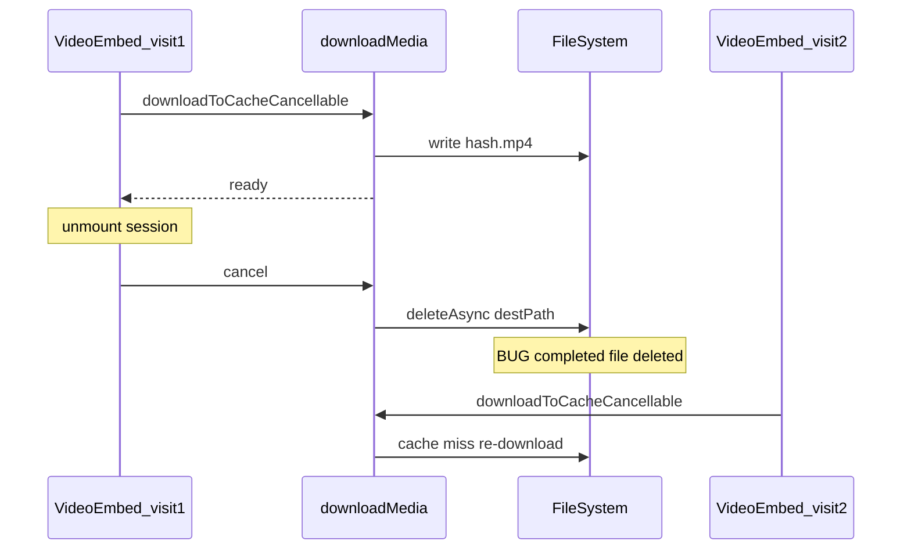

# Plan: Fix gateway video playback, cache, and follow-ups

**Purpose:** Handoff document for a new agent. Read this end-to-end before changing code.  
**Repo:** `clawboy-expo` (Expo / React Native OpenClaw client)  
**Related server doc:** [gateway-range-support.md](./gateway-range-support.md) (may already exist — server-side Range/206 fix)

---

## Executive summary

1. **Root cause (original bug):** iOS `AVPlayer` / `expo-video` streams remote URLs with HTTP `Range:` requests. The OpenClaw gateway endpoint `GET /__openclaw__/assistant-media?source=…` responds with `200 OK` and the **entire** body instead of `206 Partial Content` for the requested range → `CoreMediaErrorDomain -12939` ("byte range length mismatch"). Images still work because they are not loaded the same way.

2. **Client workaround (mostly implemented):** Download the file with `expo-file-system` (`Authorization: Bearer …`), then play from a local `file://` path so AVFoundation does not issue HTTP Range against the gateway.

3. **Bugs found while testing the partial implementation:**
   - **Cache wiped on every session switch:** `cancel()` deletes the destination file even after download completed. Fix: track `completed` and no-op delete in `cancelFn` once done; remove registry entries after success/error.
   - **"Video unavailable" after 100% download with `-12847` / `-12864`:** Saved bytes are not a decodable MP4 (often HTML error page saved as `.mp4`, or bad/truncated payload). Fix: sniff first bytes after download; surface `MediaFailureReason` `'html'` / `'other'`; add `__DEV__` hex head log.

4. **Still to do:** Settings UI (cache toggle + clear), wire `clearMediaCache` on profile switch / disconnect if not already, tests, verify `cancelAllDownloads` cannot delete completed cache files.

---

## Key files (implement / inspect here)

| Area | Path |
|------|------|
| Download + LRU + cancel | `src/lib/media/downloadMedia.ts` |
| Video UI + download-then-play | `src/components/chat/VideoEmbed.tsx` |
| Replay preference hook | `src/hooks/useMediaCacheReplay.ts` |
| Auth’d media URL + headers | `src/lib/media/gatewayMedia.ts`, `src/hooks/useAuthedMedia.ts` |
| Failure classification (GET probe) | `src/lib/media/diagnoseMediaFailure.ts` |
| Save/share (uses `downloadToCache`) | `src/lib/media/mediaActions.ts` |
| Profile id for cache namespace | `src/hooks/useServerConfig.tsx` → `activeProfile?.id` |
| Connection generation / disconnect | `src/hooks/useConnection.ts`, `src/contexts/ConnectionContext.tsx` |
| Settings UI (to add) | `src/components/settings/SettingsMetaPanels.tsx` (or sibling) |

---

## Diagnosis detail

### Symptom A: `-12939` on remote URL

```
CoreMediaErrorDomain Code=-12939
"byte range length mismatch - should be length 2 is length <full file size>"
```

Server returned full file for a 2-byte Range probe. Long-term fix: server implements Range (see `docs/plans/gateway-range-support.md`).

### Symptom B: `-12847` after download completes

`FFR_Common` / `FigFilePlayer` — unsupported or corrupt media. Likely causes:

- Gateway returned **HTML** (401/403 page, SPA shell, error) with status 200 and client saved it as `.mp4`.
- **Truncated** or non-MP4 bytes.
- Valid container but **codec** iOS cannot decode (less common for typical agent-generated MP4).

**Action:** Post-download validation + dev hex log (see checklist B2/B3).

### Symptom C: Re-download every time user leaves and reopens the session

**Cause:** `VideoEmbed` unmount cleanup calls `handle.cancel()`. In `downloadMedia.ts`, `cancelFn` always runs `FileSystem.deleteAsync(destPath)` even when the download already finished — so the persistent cache file is deleted on every navigation away.

---

## Implementation checklist (for the agent)

Copy into your own todo list; statuses reflect repo state at last plan update.

### Done (verify in tree before re-doing)

- [x] `downloadToCacheCancellable` with progress, profile-scoped hash key, ephemeral subdir, HEAD 256 MB cap, LRU manifest (1 GB), `clearMediaCache`, `cancelAllDownloads`, `getMediaCacheUsageBytes`
- [x] `useMediaCacheReplay` — AsyncStorage key `clawboy-media-cache-replay`, default replay **on**
- [x] `VideoEmbed` — download-then-play state machine, `useVideoPlayer({ uri: localUri })`, `connectGeneration` in effect deps for disconnect cancel

### Must fix (blocking correct behavior)

- [ ] **B1 — Cancel must not delete completed cache** (`src/lib/media/downloadMedia.ts`)
  - Inside `doDownload`, `let completed = false`. Set `completed = true` only after successful write + manifest update (and before resolving).
  - `cancelFn`: if `completed`, return immediately (no `deleteAsync`).
  - Remove `destPath` from `cancelRegistry` / `inflight` as soon as the download finishes (success or terminal error), not only on explicit cancel.
  - Ensure `cancelAllDownloads()` never deletes files whose download already completed.

- [ ] **B2 — Validate saved file** (`src/lib/media/downloadMedia.ts`)
  - After `downloadAsync` 2xx, read first bytes (e.g. first 12–64 bytes via `readAsStringAsync` with base64 + decode, or `readAsStringAsync` UTF-8 if safe for binary — prefer base64 slice).
  - If looks like HTML (`<`, `<!DOCTYPE`, `<html`) or `Content-Type` includes `text/html`: delete file, throw typed error with `MediaFailureReason 'html'`.
  - If size 0: delete, throw `'other'`.
  - Optional: for `.mp4`, if bytes at offset 4–7 are not ASCII `ftyp`, `__DEV__` warn only (some valid files may differ; do not false-positive hard-fail without evidence).

- [ ] **B3 — `__DEV__` log** after validation: `[downloadMedia] cached <hash><ext> size=<n> head=<hex12>` — no URL, no token.

- [ ] **`VideoEmbed` catch branch** — if error is `MediaSavedFileError` (or equivalent), set `phase: 'error', reason` from the error instead of always calling `diagnoseMediaFailure` (avoids redundant GET and wrong classification).

### Product / lifecycle

- [ ] **Cache lifecycle** — Call `clearMediaCache()` when active profile id changes and on logout/disconnect (in addition to existing `removeProfile` if any). Confirm `useConnection` calls `cancelAllDownloads()` on disconnect; after B1, verify it does not wipe good cache.

- [ ] **Settings UI** (`SettingsMetaPanels.tsx` or new section)
  - Switch bound to `clawboy-media-cache-replay` (same semantics as `useMediaCacheReplay`).
  - Row: "Clear downloaded media" → `clearMediaCache()` → `Alert` success (optional: show `getMediaCacheUsageBytes()` before clear).

### Tests

- [ ] `src/lib/media/__tests__/downloadMedia.test.ts` — progress, dedup, profile isolation, size cap, LRU, **cancel after completion does not delete file**, **HTML body → throw + no file left**
- [ ] `VideoEmbed` tests/snapshots — loading, error, fast path on cache hit (minimal progress UI)

### Manual QA

- [ ] Discord (or repro) session: video plays after download when bytes are valid MP4.
- [ ] Same session, navigate away and back: **no full re-download** when replay pref on (may flash loading briefly until cache hit resolves — acceptable if instant after B1).
- [ ] Toggle replay off: ephemeral file deleted on unmount; revisiting re-downloads.
- [ ] Profile switch / logout: policy matches product spec (clear vs keep — plan says clear on switch/logout for privacy; align implementation).
- [ ] If gateway returns HTML: user sees `MediaFallbackCard` with html-related reason, not silent player failure.

### Server (separate repo)

- [ ] Implement or verify `docs/plans/gateway-range-support.md` in `openclaw` so clients can stream without full download when ready.

---

## Security notes (do not regress)

- Never log tokens or full gateway URLs with secrets; cache keys are hashed (`profileId + NUL + url`).
- Media cache under `FileSystem.cacheDirectory`; `setExcludedFromBackupsAsync` on cache dirs.
- Bearer token only in download headers, not in `file://` path.
- See `.cursorrules` in repo root for full security posture.

---

## Mermaid: cancel bug (current broken behavior)



---

## Reference: hex patterns for `__DEV__` logs

- MP4 typically: offset 4 bytes = `66 74 79 70` (`ftyp`).
- HTML `<!DOCTYPE`: starts with `3C 21 44 4F 43 54 59 50 45` etc.

---

## Cursor plan mirror

A shorter living copy may exist at `.cursor/plans/fix_video_range_mismatch_4182ef3a.plan.md`. **This `docs/plans/` file is the canonical handoff** for agents and code review; update both if the plan changes materially.
