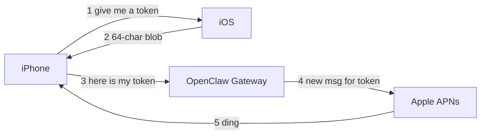

# Push Notifications — Design Notes & Phased Plan

> Status: **Deferred / Phase 2 feature.** See [.cursorrules](../../.cursorrules) — "Push notifications (Phase 2)".
> Last updated: 2026-04-23
> Related: [.cursor/plans/background-reconnect-state-preservation_ec846e4d.plan.md](../../.cursor/plans/background-reconnect-state-preservation_ec846e4d.plan.md) (landed — handles background grace window; does NOT provide real background wake)

## TL;DR

Adding push notifications to ClawBoy is a ~**2.5 - 4 week** full-stack project. The OpenClaw gateway already has ~90% of the server-side APNs infrastructure we need, but it's wired to wake **iOS *nodes*** (capability providers), not to notify **chat *clients*** (us). A small gateway PR teaches it to do the latter. A fast "demo only" version (1-2 days) is possible by piggybacking on the existing node-push flow.

## Background — What's an APN?

**APNs = Apple Push Notification service.** It's the only pipe Apple allows for showing a notification on an iPhone's lock screen when the app isn't open.

Apple's rules:

- An app can't keep a network connection open in the background. iOS suspends it after ~30 seconds.
- To show "new message" alerts, **a server** has to tell Apple "ping this phone," and Apple forwards it.
- That middleman is APNs.

Flow:



The "token" is a random string identifying this specific phone + app install. With the token, the server can ring your phone. Without it, nothing.

So "implement push notifications" always has two sides:

1. **Phone side** — request permission, get a token, hand it to the server.
2. **Server side** — store the token, call APNs when something worth notifying happens.

Can't do just the app half. That's why the plan below is full-stack.

## Investigation — What OpenClaw Gateway has today

Landed as of v2026.3.12:

- [PR #20307](https://github.com/openclaw/openclaw/pull/20307) — initial APNs pipeline (direct HTTP/2 + P8 key).
- [PR #43369](https://github.com/openclaw/openclaw/pull/43369) — App Attest + relay for TestFlight/official builds (3,242 LOC, size XL, merged 2026-03-12).

### Concrete surface

**Registration** — as a `node.event`, not an RPC:

```typescript
// src/gateway/server-node-events.ts
case "push.apns.register": {
  const token = typeof obj.token === "string" ? obj.token : "";
  const topic = typeof obj.topic === "string" ? obj.topic : "";
  const environment = obj.environment;
  await registerApnsToken({ nodeId, token, topic, environment });
}
```

**Delivery** — `src/infra/push-apns.ts`:

- `sendApnsAlert({ title, body })` — visible notification.
- `sendApnsBackgroundWake({ wakeReason })` — silent push.

**Testing**:

- RPC `push.test` (gated on `operator.write`) — sends an alert to a registered node.
- CLI `openclaw nodes push --title ... --body ...`.

**Transports**: Two.
- **Direct** — gateway holds the APNs P8 key; sends over HTTP/2 to Apple. Fine for dev / self-hosted.
- **Relay** — App Attest-verified registration with a gateway-bound send grant, routed through an external relay. Required for TestFlight / App Store builds where the server can't hold APNs keys.

### The critical gap

Everything above is designed for **iOS *nodes***, not **chat *clients***. A node is a device that *executes capabilities* (`location.get`, `camera.snap`, `node.invoke`) on behalf of the gateway. ClawBoy is the opposite role — a chat client reading agent responses.

- There is **no gateway code that pushes a "your AI responded" alert to a paired chat client**.
- `device.pair.*` (chat pairing) has **no token field, no push registration hook**.
- Issue [#30138](https://github.com/openclaw/openclaw/issues/30138) asking for client wake was closed `not_planned` (effectively superseded by node-focused #43369).

```mermaid
flowchart LR
  subgraph exists[Exists today]
    iosNode[iOS Node app] -- "push.apns.register event" --> gw[Gateway]
    gw -- "sendApnsBackgroundWake on node.invoke" --> APNs1[APNs]
    APNs1 --> iosNode
  end
  subgraph missing[Missing for ClawBoy]
    clawboy[ClawBoy client] -. no hook .-> gw2[Gateway]
    gw2 -. no chat-complete trigger .-> APNs2[APNs]
    APNs2 -. .-> clawboy
  end
```

## Why would OpenClaw accept a gateway PR when #30138 was closed?

Honest answer: **no guarantee.** But reasons to be optimistic:

1. **#30138 wasn't actually rejected.** The bot closed it `stale` with "Closing due to inactivity" — the author stopped replying. A month later, @ngutman landed [#43369](https://github.com/openclaw/openclaw/pull/43369) building nearly what #30138 asked for, just scoped to a different customer (iOS nodes). The machinery exists; priority was different.

2. **This PR asks for something different from #30138.**
   - #30138: wake a *node* so it can run a scheduled task. Niche.
   - Our Phase 2: tell the user their *chat response is ready*. Table-stakes for any chat app. Broad appeal.

3. **It's a small additive change.** New RPC methods, new store partition. Reuses `push-apns.ts` primitives. No breaking changes. Behind a gateway config flag.

4. **Maintainers already know the code.** They just shipped it.

5. **Aligned with direction.** Gateway team shipped App Attest + relay specifically for iOS chat clients. Enabling a first-class iOS client (ClawBoy) to notify properly fits.

**Risks worth naming:**

- They may want the push trigger in a plugin/hook system rather than hardcoded in the chat event dispatcher.
- They may push back on the throttling or preference surface.
- Scope creep — "add Android/FCM in the same PR."

**Mitigation:** open a GitHub **discussion issue** first ("I'm building ClawBoy and want to add chat-device push — here's my proposed RPC surface, thoughts?") before committing to a week of PR work. Cheap certainty.

Worst case: fork the gateway, or fall back to Path A (piggyback as a fake node). Not locked in.

## Effort summary

- **Full plan (A + B + C)**: ~2.5 - 4 weeks focused work.
  - Client scaffolding (permissions, token capture, tap-handling, UI): **2 - 3 days**
  - Protocol layer additions + registration lifecycle: **1 - 2 days**
  - Gateway PR (chat-complete trigger + registration): **3 - 5 days** + review cycles
  - App Attest / relay for TestFlight: **3 - 5 days**
  - Physical-device QA, iOS edge cases, tests: **2 - 3 days**
- **Fast demo version (piggyback only)**: **1 - 2 days**

## Key references in this repo

- [src/lib/openclaw/client.ts](../../src/lib/openclaw/client.ts) — WS client; add push registration after `hello-ok`.
- [src/lib/openclaw/index.ts](../../src/lib/openclaw/index.ts) — protocol module barrel; add `push.ts`.
- [src/hooks/useConnection.ts](../../src/hooks/useConnection.ts) — already handles AppState; hook push token refresh here.
- [app/_layout.tsx](../../app/_layout.tsx) — add `NotificationsProvider` in provider tree.
- [app.json](../../app.json) — `expo-notifications` plugin already wired (`mode: "development"`). Flip to `production` for release.
- [ios/clawboyexpo/clawboyexpo.entitlements](../../ios/clawboyexpo/clawboyexpo.entitlements) — already has `aps-environment=development`.
- [package.json](../../package.json) — `expo-notifications@55.0.19` already installed. **No new deps required for Phase 1 or 2.**

## Gateway references (in `openclaw/openclaw`)

- `src/infra/push-apns.ts` — registration store, `sendApnsAlert`, `sendApnsBackgroundWake`, direct + relay transports.
- `src/gateway/server-methods/push.ts` — `push.test` handler.
- `src/gateway/server-node-events.ts` — handles the `push.apns.register` node event today.
- `src/gateway/server-methods/nodes.ts` — `maybeWakeNodeWithApns`, `maybeSendNodeWakeNudge`, throttling patterns to mirror.
- iOS relay client reference: `apps/ios/Sources/Push/` (`PushRelayClient.swift`, `PushRelayAppAttestService`, `PushRelayKeychainStore`).

---

## Phase 1 — Client scaffolding

Ship an end-to-end dev path using the **existing** `push.apns.register` node event. Gateway thinks ClawBoy is a node; pushes must be fired manually via `push.test` or a small user-side script. Validates the entire iOS pipeline before touching the gateway.

1. **New hook**: `src/hooks/useNotifications.ts` — wraps `expo-notifications`:
   - Request permission on first launch via `Notifications.requestPermissionsAsync()`. Gate behind a user toggle in Settings (default off).
   - Get APNs device token via `Notifications.getDevicePushTokenAsync()` (not ExponentPushToken — we want raw APNs so the gateway can send directly).
   - Set `Notifications.setNotificationHandler({ shouldShowAlert: ... })` for foreground presentation.
   - Register tap-handler via `Notifications.addNotificationResponseReceivedListener` — parse `payload.sessionKey` and route.

2. **Protocol module**: new `src/lib/openclaw/push.ts`:
   - `registerApnsToken(call, { token, topic, environment })` → sends `node.event` with name `push.apns.register`.
   - Expose from [src/lib/openclaw/index.ts](../../src/lib/openclaw/index.ts).
   - Add `registerApnsToken(...)` method on `OpenClawClient` in [src/lib/openclaw/client.ts](../../src/lib/openclaw/client.ts).

3. **Lifecycle**: in [src/hooks/useConnection.ts](../../src/hooks/useConnection.ts), after `status === 'connected'`, if permission granted and token present, call `client.registerApnsToken(...)`. Re-register on token change (`addPushTokenListener`) and on reconnect.

4. **Context**: add `src/contexts/NotificationsContext.tsx` to the provider tree in [app/_layout.tsx](../../app/_layout.tsx). Stores permission state + latest token + tap-navigation intent.

5. **Routing on tap**: when tap occurs before hydration, stash `sessionKey` in a ref; `NavigationShell` consumes after `isHydrated` and calls `router.push`.

6. **Settings UI**: a "Notifications" row with a toggle. On enable: request permission, show current status. On disable: send `push.apns.unregister` (**not yet supported by gateway; document as TODO**).

7. **Security notes** (see [.cursorrules](../../.cursorrules)):
   - Store APNs token in `AsyncStorage` for quick re-send; **never log it**. Not a bearer credential but treat as PII.
   - Default push body to generic "New message" with no preview. Preview text leaks to Apple; given OpenClaw can touch banking/email/files, this matters. Offer an opt-in toggle for previews.

8. **Tests**:
   - Unit: `src/lib/openclaw/push.ts` frame shape.
   - Unit: `useNotifications` token-refresh → re-register flow with a mock client.
   - Snapshot: Settings row states.

9. **Dev validation** (no gateway changes):
   - Build on physical iPhone (simulator can't receive APNs).
   - Connect to local gateway; confirm `push.apns.register` event arrives (gateway logs).
   - Fire `push.test` RPC or `openclaw nodes push --title "hi" --body "world"` → alert arrives.

**Deliverable**: flag-gated feature that works end-to-end when someone manually fires a push. No chat-event integration yet.

## Phase 2 — Gateway PR

Small-to-medium PR against `openclaw/openclaw`. Triggers pushes on chat events for paired chat *devices*.

1. **Schema**: new `src/gateway/protocol/schema/device-push.ts`:
   ```typescript
   DevicePushRegisterParamsSchema = {
     token: string,
     topic: string,
     environment: "sandbox" | "production",
     deviceId: string,
   }
   ```

2. **New RPC**: `device.push.register` in `src/gateway/server-methods/device.ts`. Binds token to the paired chat device (from `device.pair.approve`), not a node. Reuses `registerApnsToken` with a new store partition `chat-devices/`.

3. **New RPC**: `device.push.unregister` for opt-out / deauth.

4. **New trigger**: hook chat stream completion. When an assistant turn completes for a session owned by a paired chat device, and that device has an APNs registration **and is not currently connected via WebSocket**, call `sendApnsAlert({ title: agentName, body: messagePreview })`.
   - Truncate body to ~120 chars.
   - Strip tool outputs and raw thinking — only final assistant text.

5. **Throttling**: mirror `NODE_WAKE_THROTTLE_MS`. Cap to one alert per session per ~10s to avoid flooding on rapid multi-turn responses.

6. **Preferences**: optional `device.push.settings` RPC for `{ onAssistantComplete, onToolCall, quietHours: [start, end] }`.

7. **Tests**: mirror `src/gateway/server-methods/push.test.ts`. Cover:
   - Registered + disconnected → push fires.
   - Registered + connected → no push.
   - Throttle behavior.
   - No registration → silent no-op.

8. **Docs**: add `docs/push-notifications.md` to `openclaw/openclaw`.

9. **ClawBoy integration**: swap `push.apns.register` node event for new `device.push.register` RPC. One-line change in `src/lib/openclaw/push.ts`. Keep feature detection so older gateways fall back to the node event.

## Phase 3 — Relay / App Attest (TestFlight + App Store)

Only required to ship outside dev builds. Gateway side already landed in [#43369](https://github.com/openclaw/openclaw/pull/43369); ClawBoy needs the iOS client side. **Biggest effort unknown.**

1. **Swift (Expo prebuild / config plugin)**: port `PushRelayClient.swift`, `PushRelayAppAttestService`, `PushRelayKeychainStore` from `apps/ios/Sources/Push/`. ~400-800 lines of Swift.

2. **Gateway identity binding**: call `gateway.identity.get` RPC (exists in #43369); include identity in the attested relay registration payload.

3. **Attest lifecycle**: generate a DCAppAttest key, attest it, save **pending** attestation, submit to the relay, mark attested **only on 2xx** (the fix Aisle flagged in #43369 review).

4. **Fallback**: keep direct-APNs path for non-official builds via `PushBuildConfig.isOfficial`, same pattern as reference PR.

5. **Entitlement flip**: switch [ios/clawboyexpo/clawboyexpo.entitlements](../../ios/clawboyexpo/clawboyexpo.entitlements) to `aps-environment=production` for release builds via an Expo config plugin conditional on `EAS_BUILD_PROFILE`.

6. **`app.json` plugin**: set `expo-notifications.mode: "production"` for release profiles.

## Out of scope (deliberately)

- **Android / FCM**: iOS-only for MVP. +1-2 weeks if needed.
- **Rich notifications / reply-from-notification**: Notification Service Extension + Intents UI Extension. +1 week.
- **Silent background wake to reconnect WebSocket**: interesting but tight iOS budgets (silent push quota, 30s execution). Revisit as Phase 4.
- **E2E-encrypted payloads**: APNs alert body leaks to Apple. Default generic body; opt-in previews. Real E2EE of push content is a separate project (would need per-device symmetric key + client-side decrypt via Notification Service Extension).

## Recommended rollout

1. **Land Phase 1** behind `Settings → Notifications` toggle (default off). Ship to yourself. Validate with `push.test` or CLI.
2. **Open a gateway discussion issue** in `openclaw/openclaw` — propose the RPC surface. Get maintainer sign-off cheaply.
3. **Land the gateway PR** (Phase 2). Keep ClawBoy backward-compatible (feature-detect `device.push.register`).
4. **Tackle Phase 3** only when prepping for TestFlight.

Each phase is independently valuable and shippable.

## Open questions to resolve before starting

- **Build distribution target**: dev-only (direct APNs, no App Attest) or relay-ready (TestFlight / App Store)? Answer changes whether Phase 3 is required.
- **Gateway maintainer appetite**: file the discussion issue early and let their response shape Phase 2 scope.
- **Privacy default**: generic "New message" body, or full preview? Default should almost certainly be generic given OpenClaw's data-sensitivity profile.
- **Android MVP**: in or out? If in, Phase 2 RPC surface should be transport-agnostic (`device.push.register` takes a `provider: "apns" | "fcm"` discriminator).
